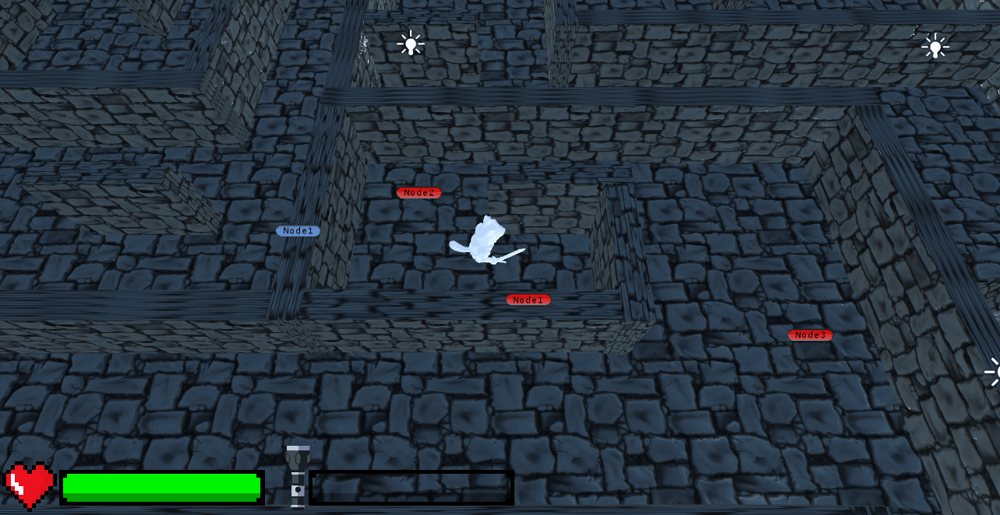

# Tamagochi Hell
Welcome to this little game where your fallen Tamagochi pet must fight for its life... in the afterlife. Forgot to feed it, did you? Well, at least help it out of here.
Sneak past the guards to find the exit out of this personal afterlife-prison. Be careful not to be left in the dark, though.

This game is a fun little project made in Unity using C#.

## Guards
Don't let the guards catch you. The AIs do their patrols peacefully as long as you aren't in their line of sight and - most importantly - quiet. Equipped with a short line of sight but bat-like hearing, they'll know your location once the sound of your footsteps reach them. The more you run, the louder you are.

The guards are state machines capable of three states: patrolling, hunting, fighting.

### Patrolling

### Hunting
The sound of your footsteps reaches a guard. Hunts you to last heard location. Better hide!

### Fighting
When all else fails, bonk them with your flashlight.

## Light
Unfortunately, fighting means you break your flashlight. Keep an eye out for stray batteries.

